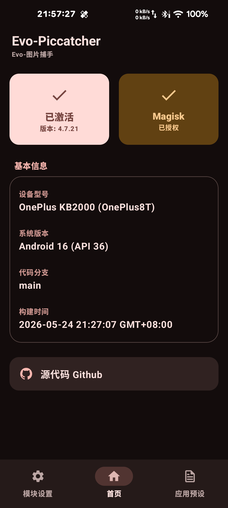
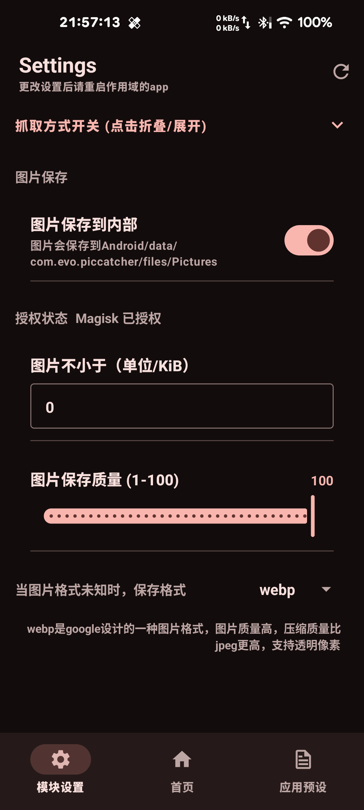
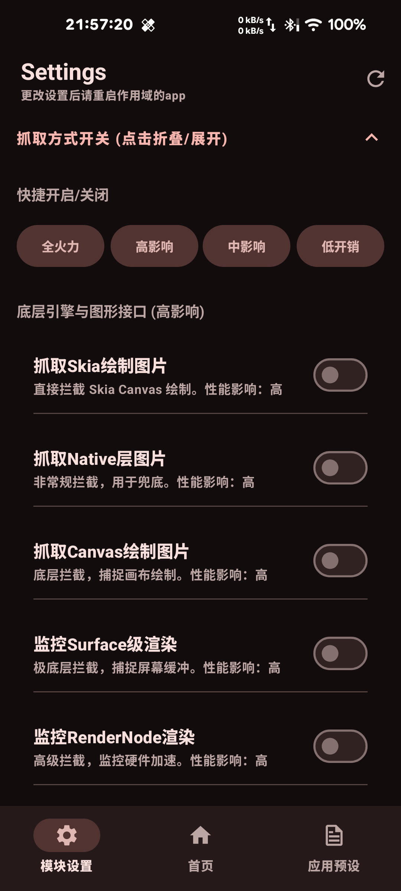
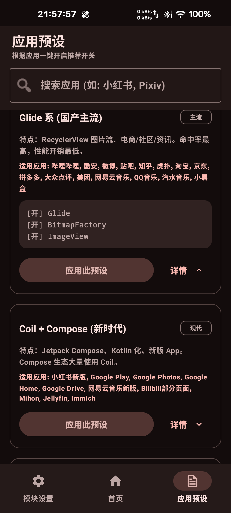

[English](./README_EN.md)

# Evo-PicCatcher（图片捕手）

本项目仓库地址：[Evo-PicCatcher](https://github.com/Evo-creative/Evo-PicCatcher)

> **注意**：Xposed 模块仓库仅发布 Release，不提交源码。本项目基于 [Mingyueyixi/PicCatcher](https://github.com/Mingyueyixi/PicCatcher) 进行深度重构与功能扩展。

## 项目介绍

Evo-PicCatcher 是一款 Android 图片自动化抓取工具。它就像一个“图片漏斗”，通过 Xposed 框架拦截 App 的显示流程，把你在 App 里看到的图片自动保存到手机里。

## 支持的抓取方式

为了确保能抓到不同 App 里的图片，我们提供了多种拦截手段（可在设置中自由开关）：

*   **标准图片库拦截（低开销，推荐开启）**：
    *   **流行框架**：支持 Glide, Coil, Fresco, Picasso 等主流图片加载库。
    *   **系统原生**：拦截系统自带的图片解码（Bitmap）和显示组件（ImageView）。
    *   **网络与文件**：直接从 App 的网络请求或本地文件读取中提取图片。
*   **现代框架适配（中影响）**：
    *   **网页图片**：支持抓取网页（WebView）中的图片资源。
    *   **跨平台框架**：专门针对 **Flutter**、**Jetpack Compose**、**React Native** 和 Litho 等新一代 App 开发框架进行了深度适配。
*   **底层渲染拦截（强力模式，用于兜底）**：
    *   **绘图引擎**：直接拦截系统底层的绘图指令（Canvas, Skia）。
    *   **屏幕渲染**：监控屏幕画面渲染过程（Surface, RenderNode, HardwareRenderer），只要屏幕上显示出来了，就有机会抓到。

## 功能亮点

- **智能预设**：提供“高、中、低”三档快捷开关，小白用户也能一键配置。
- **自动去重**：同样的图片不会重复保存，节省你的手机空间。
- **流畅运行**：图片保存过程在后台异步完成，不影响你正常刷 App。
- **防止相册杂乱**：支持生成 `.nomedia` 文件，防止抓取的图片瞬间塞满你的系统相册（可在设置中关闭）。

## 使用说明

1.  **环境要求**：需安装 **LSPosed** 管理器，且设备已获取 **Root 权限**。
2.  **激活模块**：在 LSPosed 中勾选“图片捕手”，并在作用域中选择你想要抓图的 App。
3.  **配置开关**：
    *   打开“图片捕手”App -> 进入设置。
    *   建议先尝试“低开销”预设，如果抓不到图，再开启“中影响”或“高影响”模式。
4.  **图片查看**：
    *   默认保存路径：手机内部存储的 `Pictures/PicCatcher` 文件夹下。
    *   内部保存路径：手机内部存储的 `Android/data/com.evo.piccatcher/files/Pictures` 文件夹下。

## 页面展示

| 首页 | 设置 | 设置 (拦截开关) | 应用预设 |
|--------|--------|--------|--------|
|  |  |  | |

## 隐私与安全说明

*   **本地处理**：所有图片抓取和保存都在你的手机本地完成，没有任何联网上传功能，保护你的隐私。
*   **不费流量**：我们是拦截已经下载好的数据，不会产生额外的上网流量。

---
如果有新的功能建议或发现抓不到图的 App，欢迎提交 [Issue](https://github.com/Evo-creative/Evo-PicCatcher/issues)。

## 开源协议与授权

本项目已获得原作者 **Mingyueyixi** 的正式授权，并使用 **GPL-v3.0** 开源协议。
