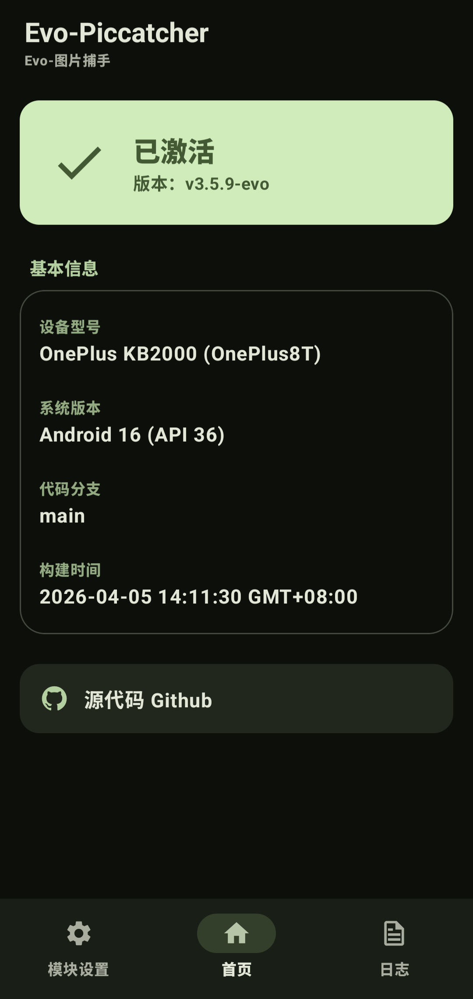
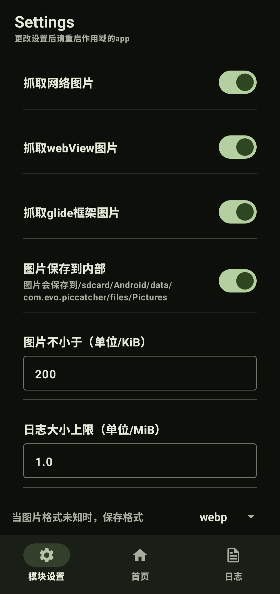

[English](./README_EN.md)

# Evo-PicCatcher（图片捕手）

本项目基于 [PicCatcher（图片捕手）](https://github.com/Mingyueyixi/PicCatcher) 修改与扩展。

## 项目介绍

Evo-PicCatcher 是一个用于抓取应用运行过程中所显示图片的工具，适用于调试、分析与自动化等场景。

如果有新的功能建议，欢迎提交 Issue，作者会根据情况进行实现。

## 相较原项目的改进

- 使用 Material Design 3 规范重构用户界面  
- 增加更多图片捕捉方式：
  - ImageDecoder
  - Coil
  - Native  
- 支持将图片保存至应用私有目录（Android/data），避免被系统相册扫描  
- 新增日志功能，方便调试与问题定位

## 效果展示

| 首页 | 设置 |
|--------|--------|
|  |  |

## 注意

本项目的新增代码主要由 AI 辅助生成，请在使用前自行评估其稳定性与安全性。

## 隐私说明

所有图片处理均在本地完成，不会收集或上传任何数据。
